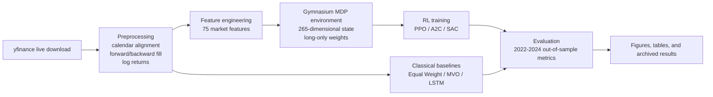

# Reinforcement Learning Approaches for Autonomous Portfolio Optimization
[](https://colab.research.google.com/drive/115M1bbr-IdUY4AJrwjdVlC-24ORg0S9K)


This repository contains the final code, results, and documentation for my undergraduate research project on autonomous portfolio optimization. The project compares three reinforcement learning agents (PPO, A2C, SAC) against three non-RL baselines (Equal Weight, Mean-Variance Optimization, LSTM) on a cross-market universe of nine ETFs spanning the United States and India. All experiments use live market data downloaded through `yfinance`, a fixed train/test split from January 2010 to December 2024, and a custom CVaR-adjusted Sharpe reward designed to balance return-seeking behavior against tail risk, concentration, and turnover.

## Project Summary

- **Author:** Sujal Suman
- **Institution:** Manipal University Jaipur
- **Program:** B.Tech. Data Science
- **Dataset window:** January 2010 to December 2024
- **Trading days:** 3,884
- **Train split:** January 2010 to December 2021 (3,108 days)
- **Test split:** January 2022 to December 2024 (776 days)
- **Assets:** `SPY`, `QQQ`, `TLT`, `GLD`, `SLV`, `NIFTYBEES.NS`, `BANKBEES.NS`, `JUNIORBEES.NS`, `GOLDBEES.NS`
- **RL training budget:** 600,000 timesteps per agent
- **LSTM baseline:** 2-layer LSTM with attention, hidden size 256, sequence length 60, 50 epochs
- **Hardware used:** Google Colab T4 GPU (15.6 GB VRAM, CUDA 13.0)

## Key Results

Out-of-sample performance on the 2022-2024 test period:

| Strategy | Sharpe Ratio | Cumulative Return | Max Drawdown |
| --- | ---: | ---: | ---: |
| PPO | 7.216 | +1138.9% | -4.86% |
| SAC | 2.736 | +164.3% | -6.15% |
| A2C | 2.026 | +97.2% | -13.87% |
| MVO | 1.170 | +52.3% | -10.01% |
| Equal Weight | 0.711 | +29.3% | -14.19% |
| LSTM | 0.297 | +14.8% | -17.88% |

Multi-seed PPO robustness:

- Seed `42`: Sharpe `6.211`
- Seed `123`: Sharpe `6.971`
- Mean Sharpe: `6.799 +- 0.43`
- Coefficient of variation: `6.3%`

## Novel Contribution

The main research contribution is a custom reward that combines medium-horizon risk-adjusted performance with explicit penalties for tail risk, concentration, and trading friction:

```text
R(t) = Sharpe_60d - lambda * |CVaR_5%| - gamma * HHI - delta * TC
```

with:

- `lambda = 2.0`
- `gamma = 0.02`
- `delta = 5.0`
- `TC = 0.1%` transaction cost per unit weight change
- `Sharpe_60d` computed over a fixed 60-day rolling window

State representation:

- 20-day return history: `180` values
- Engineered market features: `75` values
- Current portfolio weights: `9` values
- Normalized portfolio value: `1` value
- **Total state dimension:** `265`

## Research Evolution

This project was built in two stages. The earlier version used a smaller 4-year dataset, split into 2 years for training and 2 years for testing, and included DDPG in the RL comparison. In that setup, DDPG generalized poorly out of sample, while traditional methods were stronger than expected. That result was important rather than inconvenient: it pushed the project toward a more serious redesign with a larger 2010-2024 dataset, richer state features, a stronger reward formulation, and a final benchmark focused on PPO, A2C, SAC, LSTM, MVO, and Equal Weight.

That progression is part of the contribution. The final repository reflects the improved second-stage design, but the README documents the DDPG phase because it explains why the final methodology looks the way it does.

## Architecture



## Installation

```bash
pip install -r requirements.txt
```

If you want an isolated environment first:

```bash
python -m venv .venv
.venv\Scripts\activate
pip install -r requirements.txt
```

## How To Run

### 1. Train the RL agents

```bash
python -m src.train --algorithms ppo a2c sac --timesteps 600000 --seed 42 --models-dir models
```

This command:

- downloads the 9-ETF dataset from `yfinance`
- constructs the 265-dimensional state space
- trains PPO, A2C, and SAC on the 2010-2021 train split
- saves trained agents under `models/`

### 2. Evaluate all strategies and regenerate the paper outputs

```bash
python -m src.evaluate --models-dir models --results-dir results --seed 42
```

This command:

- evaluates PPO, A2C, and SAC on the 2022-2024 test split
- runs Equal Weight, rolling MVO, and the LSTM baseline
- writes `results/metrics.csv`
- writes `results/returns.csv`
- regenerates `results/figures/paper_results.png`
- regenerates `results/figures/data_quality.png`
- regenerates `results/figures/lstm_training.png`

### 3. Open the notebook version

```bash
jupyter notebook notebooks/RL_Portfolio_Optimization.ipynb
```

## Dataset

This project intentionally uses live downloads through `yfinance` instead of shipping static raw market CSVs.

Why this choice matters:

- It keeps the repository lightweight and avoids turning the repo into a data dump.
- It makes the full pipeline reproducible from code, which is better research practice than depending on manually exported spreadsheets.
- It avoids requiring users to trust a private local data snapshot with unclear preprocessing.
- It matches how this project was actually built in Colab: the code fetches the market panel directly, then computes log returns and engineered features programmatically.

The archived files under `results/` are included only to preserve the final published figures and summary outputs. They are not required to rerun the pipeline.

## Methodology

### Asset Universe

The portfolio universe mixes U.S. and Indian ETFs:

- U.S. equities and macro proxies: `SPY`, `QQQ`, `TLT`, `GLD`, `SLV`
- Indian ETFs: `NIFTYBEES.NS`, `BANKBEES.NS`, `JUNIORBEES.NS`, `GOLDBEES.NS`

All assets are retained because the feature space and model interfaces assume a fixed 9-asset universe.

### Returns Convention

Returns are modeled in **log-return space** for both USD and INR assets. This is intentional and consistent with standard quantitative finance practice because log returns aggregate cleanly over time and are numerically convenient for sequential models.

### Feature Design

The final state uses a fixed 75-feature representation built from:

- per-asset trend, momentum, volatility, RSI, and drawdown signals
- cross-asset macro descriptors such as rolling average correlation and market breadth proxies
- a fixed feature layout so the RL observation space remains stable across training and evaluation

### RL Setup

- **Environment:** long-only Gymnasium environment with simplex-normalized portfolio weights
- **Transaction cost:** default `0.001` per unit turnover, exposed as a parameter in code
- **Reward window:** fixed at `60` trading days
- **PPO network:** MLP `[256, 256, 128]`
- **PPO learning rate:** `2e-4`
- **A2C and SAC:** included as final RL comparators

## Results

### Data Quality Overview


### Final Comparison Figure


### LSTM Training Curve


## Project Structure

```text
RL-Portfolio-Optimization/
|-- README.md
|-- requirements.txt
|-- LICENSE
|-- .gitignore
|-- notebooks/
|   |-- RL_Portfolio_Optimization.ipynb
|-- src/
|   |-- __init__.py
|   |-- environment.py
|   |-- features.py
|   |-- reward.py
|   |-- train.py
|   |-- evaluate.py
|   |-- baselines.py
|   |-- utils.py
|-- results/
|   |-- figures/
|   |   |-- data_quality.png
|   |   |-- paper_results.png
|   |   |-- lstm_training.png
|   |-- metrics.csv
|   |-- returns.csv
|-- docs/
|   |-- reward_function.md
```

File guide:

- `README.md`: project overview, methodology, results, and usage instructions
- `requirements.txt`: pinned Python dependencies
- `LICENSE`: MIT license for publication
- `.gitignore`: excludes caches, environments, model checkpoints, and local secrets
- `notebooks/RL_Portfolio_Optimization.ipynb`: Colab-friendly notebook wrapper for the modular code
- `src/environment.py`: Gymnasium portfolio environment and trading mechanics
- `src/features.py`: fixed 75-feature engineering pipeline
- `src/reward.py`: CVaR-adjusted Sharpe reward implementation
- `src/train.py`: RL training entry point for PPO, A2C, and SAC
- `src/evaluate.py`: evaluation, metrics, figure generation, and result export
- `src/baselines.py`: Equal Weight, rolling MVO, and LSTM baselines
- `src/utils.py`: data download, preprocessing, split logic, and reproducibility helpers
- `results/figures/`: archived final figures used in the report
- `results/metrics.csv`: archived summary metrics for the published benchmark table
- `results/returns.csv`: archived return panel used in the final project bundle
- `docs/reward_function.md`: detailed explanation of the reward design

## Reproducibility Notes

- The live data pipeline depends on Yahoo Finance, so reruns may differ slightly if historical adjustments change.
- RL results are stochastic, which is why the repo reports multi-seed PPO robustness rather than a single lucky run.
- The archived figure files in `results/figures/` preserve the exact visuals used in the final project submission.

## Citation

```bibtex
@misc{suman2026portfolio,
  author       = {Sujal Suman},
  title        = {Reinforcement Learning Approaches for Autonomous Portfolio Optimization},
  year         = {2026},
  note         = {Undergraduate research project, Manipal University Jaipur, academic year 2025-2026},
  howpublished = {GitHub repository}
}
```

## License

This project is released under the MIT License. See `LICENSE` for the full text.

## Acknowledgments

- Yahoo Finance and `yfinance` for accessible market data retrieval
- Stable-Baselines3 and Gymnasium for the RL experimentation stack
- PyTorch for the LSTM and RL model backends
- Google Colab for GPU compute used during model development
- Faculty guidance and academic support at Manipal University Jaipur
